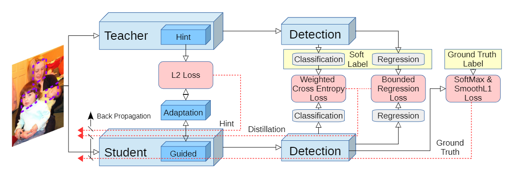
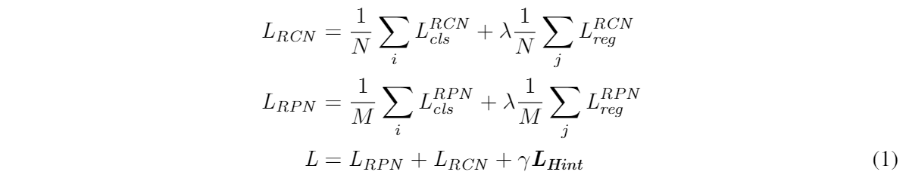
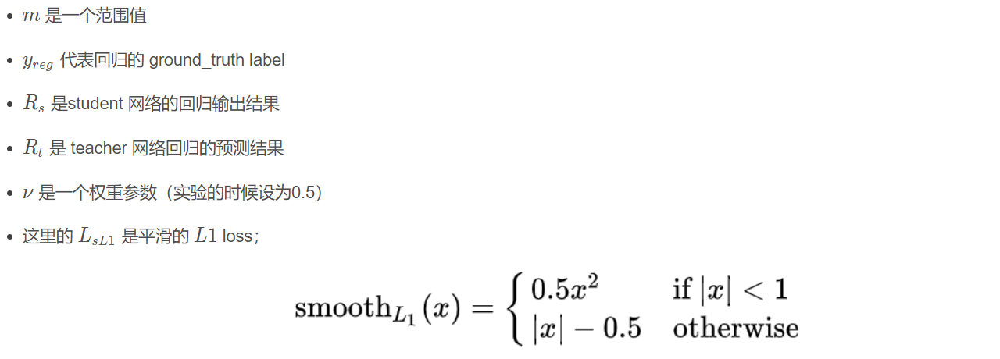
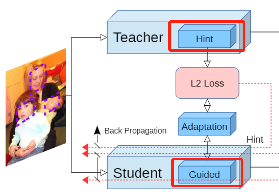

## Learning-efficient object detection

### 论文介绍

---

（1）我们采用基于提示的学习策略（hint-based learning）来促使 student 网络学习的特征更加接近 teacher 网络；

（2）我们把知识蒸馏的方法与 RCN 和 RPN 网络相结合；为了解决目标检测中严重的**不平衡问题**（背景和检测目标物体的不平衡），我们对知识蒸馏网络使用了一个具有权重的交叉熵损失（weighted cross entropy）；

（3）最后，我们把 teacher 网络回归的输出作为 “ 上界 ”，也就是说，如果 student 网络的回归输出比 teacher 网络的表现要好，那么将不会触发损失函数对其进行惩罚。

整体的损失函数设计如下：

（1）N是输入 RCN 网络的 batch size，M是输入 RPN 网络的 batch size；

（2）$L_{cls}$代表分类器的损失函数，它结合了 **hard softmax 的损失**（使用 ground_truth label 得到结果的损失）还有**软知识蒸馏产生的 soft 损失**；

（3）此外，$L_{reg}$是边界框 bounding box 回归损失 + smoothed L1 正则化损失同时也结合了我们之前提过的 teacher bounded L2 回归损失（ teacher 网络的上界损失）来激励 student 网络能够；

（4）最后，$L_{Hint}$代表的是 hint 损失函数，这个帮助 student 网络更好地模仿 teacher 特征的；

（5）$\lambda$和$\gamma$是超参数，用来控制不同损失之间的平衡，暂且设置他们分别为 1 和 0.5。

**Weighted Cross Entropy Loss & SoftMax Loss**

**偏置交叉熵损失函数**

​		这个函数的原型就是Hinton大神2015年发表的知识蒸馏开山之作“Distilling the Knowledge in a Neural Network”中提到的由学生网络学习教师网络outputs中的暗知识。具体操作就是把教师网络的输出作为soft label，与ground truth加权求和作为学生网络的训练时的label。

​		而论文中在这个基础上增加了一个偏置，其理由是背景（负样本）只有一类而前景（正样本）往往有很多类，比如PASCAL VOC有20类，COCO有80类，因此添加一个权重$w_c$，在论文的实现中背景$w_c$为1.5，而目标$w_c$为1，具体公式如下：

* 这里的 $L_{hard}$ 指 hard loss，是 Faster-RCNN 训练 teacher 网络的时候使用的损失函数（这里可以理解离散的标签是 hard label刚性的标签，给 teacher 网络用的，同样的，使用刚性标签训练时使用的损失函数就是 hard loss；

* 而连续的分布标签是 soft label 是软标签，是给 student 网络用的，使用 soft label 训练 student 网络时使用的就是 soft loss；

* 而 $L_{soft}$ 是 soft loss，是把 teacher 网络的输出结果当做 student 训练数据的 label 的时候使用的损失函数；

* $u$ 是平衡 hard loss 和 soft loss 的参数。

  

**Bounded Regression Loss & SmoothL1 Loss**

**约束回归损失函数**

​		这个函数带有一点现在focal loss的味道，其思路是在边框回归问题上，如果学生网络输出结果比教师网络差，则在原有SmoothL1 Loss上添加额外惩罚，惩罚项为L2 Loss，具体公式如下：

相比于直接把 teacher 网络的 regression 结果直接当做标签（target），我们尝试设定一个 upper bound（上界）来限定 student 网络；student 回归矢量应该尽可能地靠近 ground_truth 的 label；但如果 student 网络产生的结果超过了 teacher 网络一定的范围，我们不会采用额外的 loss 来惩罚 student 网络；我们把这种方式叫做 teacher bounded regression loss，$L_b$代表这个回归损失。

`相当于在 $L_b$ 里面结合了 L2 损失；上面式子的意思就是，当 $R_s$  和真实标签的偏差和 $R_t$ 与真实标签的偏差在一定的范围 m 之外的时候，才使用损失函数对结果进行惩罚，在一定范围 m 之内的时候，不对这个结果进行惩罚。`

回归部分的整体损失公式为：
$$
L_{reg} = L_{sL1}(R_s, y_{reg}) + v L_b(R_s, R_t, y_{reg})
$$

**Hint Learning（L2 Loss）**

**启迪学习**

​		这个Loss函数本身没有什么特别之处，就是L2 Loss，方法其实也是前人的工作，即从教师网络与学生网络中各选出一层特征层进行连接，让学生网络的特征层学习教师网络的特征层表现，来获得更好的输出层表现。就我的理解其实就是在训练过程中增加了一个约束条件，使得学生模型更容易收敛至教师网络所在的最小值处。

​		此外，论文中还有添加Adaptation layer，用于选取的特征层大小或通道不匹配时对其进行适配，并且这一层的增删对输出表现也有一定影响。

​		知识蒸馏通常完成信息和知识的传递只使用最后一层（final output）；在之前的工作中，Romero 等人证明了使用 teacher 网络的中间层表示来作为 hint 可以帮助训练和提升 student 网络的表现；他们使用了特征矢量 V  和 Z 之间的 L2 距离。

​		Z 代表我们选用的 teacher 网络的中间层作为 hint， V 代表 student 网络中被引导层的输出；如果也用 L1距离来做评估的话，公式如下：
$$
L_{Hint}(V, Z) = ||V - Z||_1
$$

* 我们引入了 hint learning，要求引导和被引导的两个层需要有相同数量的神经元（通道，宽度，高度）；这句话的意思就是：从 teacher 网络挑选出的 hint 层要与他指导的 student 里面对应的 guided 层的结构相同；
* 为了匹配这两个层的结构，我们在中间引入一个 adaption 层；让 student 中 guided 层的输出结果进入 adaption 层进行结构调整，使得从 adaption 层出来的结果能够具有和 teacher 网络的 hint 层一样的结构；
* adaption 层本质上是一个全连接层，当然 hint 层和 guided 层也都是全连接层。当 hint 和 guided 层都是卷积层时，我们采用 1 × 1 的卷积来节省内存；
* 有趣的是，我们发现多一个 adaption 层可以高效地把知识从一个网络传输到另外一个网络，即使 hint 层和 guided 层的 channel 数是一样的，也同样有效；在 hint 层和 guided 层结构不一样的时候，可以将他们的结构进行调整从而实现匹配和知识传输；
* 当 hint 层或者 guided 层是卷积层并且 hint 层和 guided 层的分辨率不同时（例如，VGG16，AlexNet）我们遵循 Compressing deep convolutional networks using vector quantization 中引入的填充技巧（padding trick）来匹配输出的数量。

将以上3个部分组合之后，就是公式（1）中的3个公式。

### 踩坑与解决办法

---

​		论文是介绍完了，但是代码中的具体实现，却有很多坑，这里我们不会像原文中，在Faster RCNN上进行蒸馏，而是在SSD上做一个例子，因此当中会有很多调整。

（1）直接看最后的组合部分，最终loss是由RCN，RPN与Hint三个部分组成，这是由于RPN网络two-stage的结构导致的，而在one-stage的SSD中，我们不需要$L_{RPN}$这个公式，故SSD上的公式如下：
$$
L_{SSD} = \frac{1}{N} \sum_{i} L_{cls}^{SSD} + \lambda \frac{1}{N} \sum_{j} L_{reg}^{SSD} \\
L = L_{SSD} + \gamma L_{Hint}
$$
修改之后，那么N是如何定义的呢，毕竟原本是 N 与 M 两个参数，且论文中并未对其有额外描述。

*解决办法：根据经验，一般来说N有两种可能，一是正例框的数量，二是正例框的数量\*4（即进行正负样本均衡后，全部样本的数量为正：负=1：3），在尝试了第一种后发现效果不错，于是就一直使用到了最后。*

（2）论文中的两个超参数 $\mu$ 与m没有给出具体数值，前者影响 hard label 和 soft label 各自的比重，后者为Bounded Regression Loss中的超参。

*解决办法：由于超参 μ涉及 hard label 和 soft label 对模型影响的比重，一开始简单定为0.5，效果很差几乎不收敛，后定为 0.8（hard 80%，soft 20%），模型能够收敛，再后来采用一种变化的参数，根据迭代次数，将 μ 从 0 到 1 递进，效果似乎更好，但由于有多个参数需要调整进行观察模型的变化，因此这个参数最终定为 0.8；超参 m，根据另外的实现代码，定为 0。*

（3）第3个坑是Coder本人导致的，由于教师模型选的是SSD，而学生模型用的是SSD Lite，分别对应 vgg 和 mobilenetv2，这就导致了 anchor boxes 分别是8732和3000，意味着只能对 feature 层进行蒸馏，而输出层无法接到一起。而**只接 feature 层是完全没有作用的**（即后面的head也必须接到一起）。

假装是示意图：

​		teacher model: VGG backbone + SSD head

​		student model: mobilenetv2 backbone + SSD Lite head

*第一次尝试解决：最开始的想法是给 mobilenetv2 backbone 加上完整的 SSD head，这样 anchor boxes 就同样是8732，然后就能够学习 vgg-ssd 的输出。然后在尝试之后发现，开源的 mobilenet bonebone 都选择接 SSD lite head。如果接完整的 SSD head会由于 mobilenet 对应的 feature 层过浅，特征提取能力不够，而导致效果不佳。*

*第二次尝试解决：反过来接，在 vgg backbone 参数不变的情况下接上随机初始化参数的 ssd lite head，然后进行 fine tune，由于 anchor boxes 减少的原因，在VOC上的 mAP 会稍许降一点（由原来的 77.49 降低至 74，但也已经比 mobilenet ssd的 68.6 要高一些），这样的另一个好处则是 mobilenet backbone + ssd lite head 的结构没有做任何修改，因此有着明确的 benchmark，只要能在此基础上能再提升一些些就可以验证方法的有效性了。*

（4）最后一个坑，是 guided layer 的选择，这一点在原论文中也没有提及具体是哪一层，看着似乎是 backbone 的输出层，但还是因为 feature 大小不一致的原因而作罢（虽然论文中有提及 guided layer 大小不一致时可以用adaption layer调整）。

**这是最后一个坑，在之前的所有问题解决之后，训练出来的 mobilenet-ssd 总算是不掉点了，但仍旧没有涨点。原因可能是（a）mAP 68.6确实已经训练的很充分了，接近这个模型在这个数据集上的极限，二来是作为教师网络的 vgg-ssd 精度不够高，结构也与 mobilenetv2 差异较大，对 mobilenet-ssd 的学习没有太大的指导意义。**

*解决办法：最终选择了 conf head 的输出层作为 guided layer，这样即没有 feature 大小不一致的问题，从反向传播的角度看，又对 6 个 feature 层进行了蒸馏学习。于是在经过多次训练验证后，证实了可以在不增加任何其它tricks的情况下增加 mobilnet-ssd mAP 0.5~1.2 的涨点。*

### 实际代码

---

代码中从肯定是从损失函数入手的，因此直接找到`odkd/train/loss.py`，在此之下进行学习。

`class ObjectDistillationLoss(nn.Module)`

### References

---

[论文详细介绍](https://blog.csdn.net/qq_42902997/article/details/108773288)

[踩坑与解决办法](https://zhuanlan.zhihu.com/p/260370225)